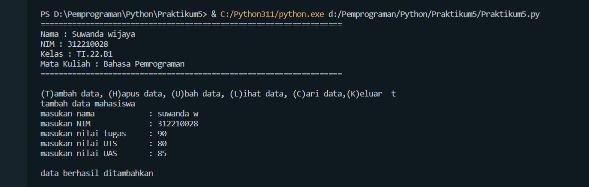

# Praktikum5


Repositiry ini dibuat untuk memenuhi tugas Pertemuan 9 - Bahasa Pemrograman (Module Praktikum 5)<br><br>
Nama : Suwanda wijaya<br>
NIM : 312210028<br>
Dosen : Agung Nugroho, M.Kom<br>
Matkul : Bahasa Pemrograman<br>
Kelas : TI.22.B.1<br>

Pada halaman ini (Tugas Pertemuan-9-Module Praktikum 5) Dosen memberi tugas sebagai berikut : <br>
* Soal Latihan yang ada pada module praktikum 5<br>
<br>
* Berikut adalah program syntax yang saya buat untuk memenuhi latihan module 5<br>

``` python
print("===================================================================")
print("Nama        : Suwanda Wijaya")
print("NIM         : 312210028")
print("Kelas       : TI.22.B1")
print("Mata Kuliah : Bahasa Pemrograman")
print("===================================================================")

# Buat dictionary daftar kontak
print("Buat dictionary nama sebagai key, dan nomor sebagai value")

isi = {'Ari': '081267888', 'Dina': '087677776'}
print("Nama | Nomor kontak")
print(isi)

print("Tampilkan Kontaknya Ari")
print(isi['Ari'])

print("Tambah kontak baru dengan nama Riko, nomor 087654544")
isi['Riko']= '087654544'
print(isi)

print("Ubah kontak Dina dengan nomor baru 088999776")
isi['Dina']= '088999777'
print(isi)

print("Tampilkan semua Nama")
print(isi.keys())

print("Tampilkan semua Nomor")
print(isi.values())

print("Tampilkan daftar Nama dan nomornya")
print(isi.items())

print("Hapus kontak Dina")
del isi['Dina']
print(isi)

print("===================================================================")
```
* Ini adalah hasil run dari syntax latihan module 5 yang saya buat <br>
<br>

* Soal Tugas Praktikum yang ada pada module praktikum 5 adalah sebagai berikut<br>
<br>
* Berikut hasil yang diinginkan pada soal praktikum  5<br>
<br>
<br>

* Setelah memahami materi saya membuat syntax sebagai berikut untuk memenuhi tugas praktikum module 5 : <br>
```python
print("===================================================================")
print("Nama : Suwanda wijaya")
print("NIM : 312210028")
print("Kelas : TI.22.B1")
print("Mata Kuliah : Bahasa Pemrograman")
print("===================================================================")


data = {}
while True:
    a = input('\n(T)ambah data, (H)apus data, (U)bah data, (L)ihat data, (C)ari data,(K)eluar  ')
    if a=="t":
        print('tambah data mahasiswa')
        nama=input('masukan nama\t\t: ')
        nim=input('masukan NIM\t\t: ')
        nilaiTugas=int(input('masukan nilai tugas\t: '))
        nilaiUts=int(input('masukan nilai UTS\t: '))
        nilaiUas=int(input('masukan nilai UAS\t: '))
        nilaiakhir=(0.30*nilaiTugas)+(0.35*nilaiUts)+(0.35*nilaiUas)
        data[nama]=nim,nilaiTugas,nilaiUts,nilaiUas,nilaiakhir
        print('\ndata berhasil ditambahkan')

    elif a=="u":
        print('ubah data')
        nama=input('masukan nama: ')
        if nama in data.keys():
            nim=input('masukan NIM baru\t: ')
            nilaiTugas=int(input('masukan nilai tugas\t: '))
            nilaiUts=int(input('masukan nilai UTS\t: '))
            nilaiUas=int(input('masukan nilai UAS\t: '))
            nilaiakhir=(0.30*nilaiTugas)+(0.35*nilaiUts)+(0.35*nilaiUas)
            data[nama]=nim,nilaiTugas,nilaiUts,nilaiUas,nilaiakhir
            print('\ndata berhasil diubah')
        else:
            print('data tidak ditemukan')

    elif a=="h":
        print('hapus data')
        nama = input('masukan nama: ')
        if nama in data.keys():
            del data[nama]
            print('data berhasil dihapus')
        else:
            print('data tidak ditemukan')
        

    elif a=='c':
        print('cari data')
        nama = input('masukan nama: ')
        if nama in data.keys():
            print("\n                   DAFTAR NILAI MAHASISWA                   ")
            print("==============================================================")
            print("|     Nama     |    NIM    | Tugas |  UTS  |  UAS  |  Akhir |")
            print("==============================================================")
            print("| {0:12s} | {1:9s} | {2:5} | {3:5} | {4:5} | {5:6} |".format(nama, nim, nilaiTugas, nilaiUts, nilaiUas, nilaiakhir)) 
            print("==============================================================")
        else:
            print('data tidak ditemukan')


    elif a=='l':
        if data.items():
            print("\n                      DAFTAR NILAI MAHASISWA                    ")
            print("==================================================================")
            print("| No |     Nama     |    NIM    | Tugas |  UTS  |  UAS  |  Akhir |")
            print("==================================================================")
            i = 0
            for x in data.items():
                i += 1
                print("| {6:2} | {0:12s} | {1:9s} | {2:5} | {3:5} | {4:5} | {5:6} |".format(x[0], x[1][0], x[1][1], x[1][2], x[1][3], x[1][4], i))  
            print("==================================================================")
        else:
            print('data tidak ditemukan')

    elif a=='k':
        print('======terimakasih=====')
        break
    else:
        print('mohon memasukan pilihan yang benar')
```
* Berikut ini adalah hasil run dari syntax diatas akan diuraikan satu persatu<br>

* *Tambah data*<br>
)<br>
* *Lihat setelah tambah data*<br>
<br>
* *Ubah data, dan pada gambar dibawah adalah hasil dari perubahan data*<br>
<br>
* *Mencari data yang diinputkan*<br>
<br>
* *Menghapus data yang diinputkan*<br>
<br>

### Demikian tugas untuk pertemuan 9 module 5 yang bisa saya sampaikan, Terima kasih...